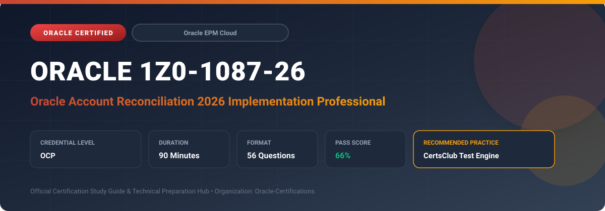

  

# Oracle 1Z0-1087-26: Oracle Account Reconciliation 2026 Implementation Professional

---

## 1. Exam Overview & Candidate Profile

The **Oracle 1Z0-1087-26: Oracle Account Reconciliation 2026 Implementation Professional** examination validates the technical expertise and real-world implementation capabilities required to successfully configure, optimize, and administer Oracle Account Reconciliation Cloud (ARCS).

Candidates validate their hands-on ability to configure Reconciliation Compliance (RC), Transaction Matching (TM), format rules, auto-reconciliation rules, profile creation, data integration with Data Management/EPM Integration Agent, periods and processing workflows, and audit reporting.

### Target Audience & Prerequisites
- **Target Roles**: Implementation Consultants, Financial Systems Analysts, EPM Administrators, General Ledger Accountants, and Solution Architects.
- **Recommended Experience**: 1–2 years of practical experience implementing Oracle Account Reconciliation Cloud Service (ARCS).
- **Credential Earned**: Oracle Certified Professional (OCP).

---

## 2. Key Exam Specifications

| Specification | Details |
| :--- | :--- |
| **Exam Code** | **Oracle 1Z0-1087-26** |
| **Official Title** | Oracle Account Reconciliation 2026 Implementation Professional |
| **Certification Track** | Oracle Enterprise Performance Management Cloud |
| **Exam Duration** | 90 Minutes |
| **Number of Questions** | 56 Questions |
| **Passing Score** | 66% |
| **Question Format** | Multiple Choice (Single/Multiple Answer), Scenario-Based Questions |
| **Delivery Provider** | Oracle University / Pearson VUE (Online Proctored or Test Center) |
| **Recommended Practice Engine** | [CertsClub Oracle Practice Tests](https://www.certsclub.com/oracle/1z0-1087-26-dumps.html) |

---

## 3. Official Blueprint & Exam Domain Breakdown

The examination assesses candidate competencies across core functional domains weighted as follows:

| Domain Area | Weighting |
| :--- | :--- |
| **Configuring Reconciliation Compliance (Formats, Profiles, Workflows)** | `30%` |
| **Transaction Matching Architecture, Rules & Reconciliation** | `25%` |
| **Data Integration, EPM Integration Agent & Balances Loading** | `20%` |
| **Security, Teams, Roles & Organizational Units** | `15%` |
| **Periods, Monitoring, Dashboards & Audit Reporting** | `10%` |

---

## 4. Deep Dive into Complex & Challenging Technical Topics

To secure a passing score on the 1Z0-1087-26 exam, candidates must master the following advanced concepts:

- **Reconciliation Compliance vs. Transaction Matching**: Structuring integrated reconciliations combining high-volume transaction matching engine output into Reconciliation Compliance balances.
- **Auto-Reconciliation Methods**: Configuring zero-balance, no-activity, balance-comparison, and variance auto-reconciliation methods on profiles.
- **Transaction Matching Rules & Tolerances**: Building rule sets incorporating date tolerances, amount tolerances, inverted signs, and multi-field matching logic (one-to-one, one-to-many, many-to-many).
- **Data Integration & EPM Agent**: Ingesting bank files, subledger details, and GL trial balance segments using Data Management and EPM Automate commands.
- **Late Notifications & Escalation Workflows**: Managing workflow hierarchies, backup preparers, reviewers, and frequency schedules across global accounting calendars.

---

## 5. Scenario-Based Demo & Practice Questions

### Question 1
An enterprise needs to automate high-volume bank reconciliations where hundreds of daily credit card clearing transactions match one aggregated settlement deposit with a 1-day processing date variance. Which Transaction Matching rule type should be configured?

A) One-to-Many matching rule with Date Tolerance rule condition  
B) Balance Comparison rule with Variance Threshold  
C) Account Analysis format with Auto-Submission  
D) Reconciliation Compliance Rule with Zero Balance filter  

- **Correct Answer**: `A) One-to-Many matching rule with Date Tolerance rule condition`  
- **Technical Explanation**: Transaction Matching supports One-to-Many match rules where multiple source system transactions match a single bank transaction, combined with a date tolerance (e.g., +/- 1 day) to account for settlement timing differences.

---

### Question 2
When creating a Reconciliation Compliance Profile, which auto-reconciliation method automatically marks the reconciliation as complete if the General Ledger balance is zero and there are no explaining items?

A) Balance Equals Zero  
B) Zero Balance and No Activity  
C) Variance Less Than Threshold  
D) Manual Sign-Off Exemption  

- **Correct Answer**: `A) Balance Equals Zero`  
- **Technical Explanation**: The "Balance Equals Zero" auto-reconciliation method automatically completes the reconciliation without requiring manual preparer submission when the account balance equals 0.00 and no unresolved transactions exist.

---

## 6. Recommended Preparation Strategy & Practice Testing Engine

Achieving certification in **Oracle 1Z0-1087-26** requires balanced theoretical study and scenario-based simulation practice:

1. **Review Oracle Documentation**: Master architecture guides, implementation workbooks, and administration manuals on the Oracle Help Center.
2. **Hands-on Lab Practice**: Execute real-world configuration, policy setup, and troubleshooting tasks in your cloud tenancy or test instance.
3. **Simulated Exam Drills**: Practice answering timed, scenario-based multiple-choice questions to familiarize yourself with the question formats, traps, and timing constraints.

### Practice With CertsClub
For realistic practice questions, updated dumps, and mock testing environments:
- **Resource**: [CertsClub Oracle Practice Test Engine](https://www.certsclub.com/oracle/1z0-1087-26-dumps.html)
- **Special Discount**: Use coupon code **`club20`** during checkout for an instant **20% discount** on all practice exam bundles and testing engines.

---

## 7. Official Documentation & References

- [Oracle University Certification Registry](https://education.oracle.com/)
- [Oracle Help Center Documentation Portal](https://docs.oracle.com/)
- [Oracle Cloud Infrastructure & Applications Guides](https://docs.oracle.com/en/cloud/)
- [CertsClub Oracle Certification Exam Practice](https://www.certsclub.com/oracle/1z0-1087-26-dumps.html)

---

## 8. SEO & Discovery Keywords

`oracle 1z0-1087-26, oracle 1z0-1087-26 exam, oracle 1z0-1087-26 dumps, 1Z0-1087-26 practice questions, 1Z0-1087-26 study guide, oracle 1z0-1087-26 syllabus, oracle account reconciliation 2026 implementation professional, certsclub 1z0-1087-26`